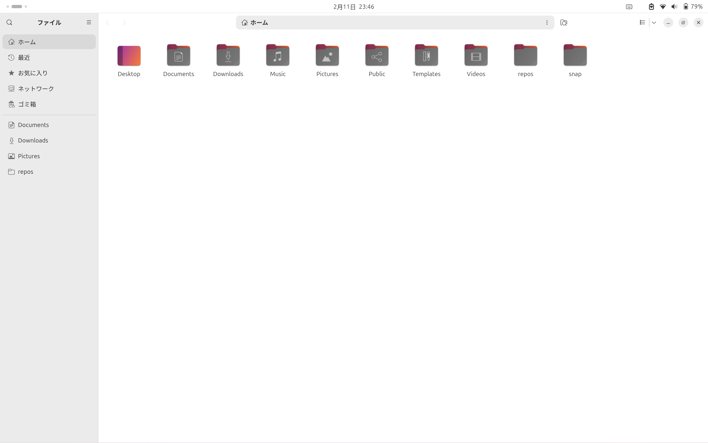
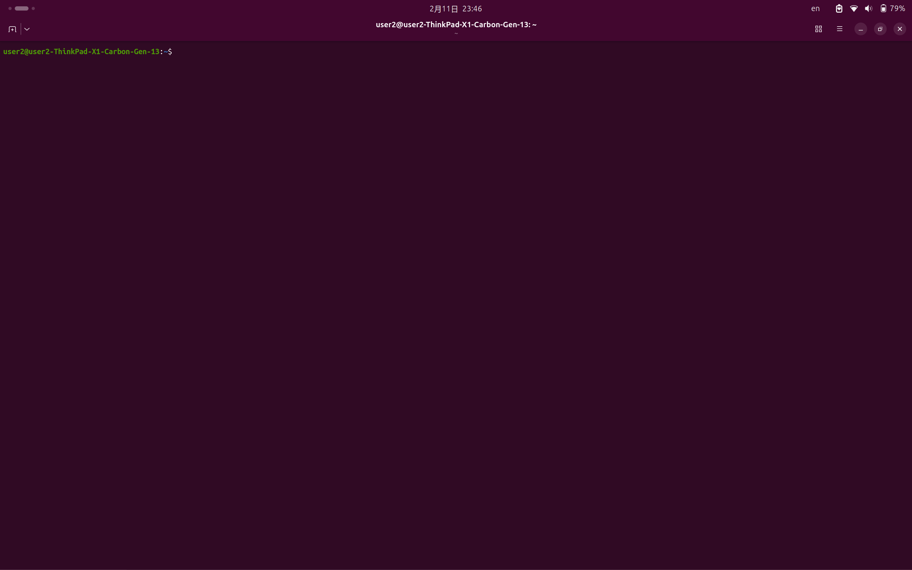

# Adaptive Panel

A GNOME Shell extension that makes the top panel color match the maximized window's header bar -- or the wallpaper when the desktop is empty.

Eliminates the visible boundary between the panel and window, creating a seamless look -- and helps prevent OLED burn-in by avoiding a static panel color.

| Light app maximized | Dark app maximized |
|---|---|
|  |  |

## What it does

| Problem | Solution |
|---|---|
| The panel stays one fixed color regardless of the window below it | Panel color automatically syncs to the maximized window's header bar |
| Dark panel + light app (or vice versa) creates a harsh boundary | Panel blends seamlessly with the active window |
| Static panel color can cause OLED burn-in | Panel color changes dynamically, reducing burn-in risk |
| Empty desktop has a panel that clashes with the wallpaper | Panel samples and matches the wallpaper when no window is maximized (theme color is used on the overview/lock screen) |

## Tip

For best results, combine with GNOME's built-in scheduled dark/light theme switching (Settings > Appearance) so the panel color adapts throughout the day automatically.

## Installation

Tested on Ubuntu 25.10 / 26.04 LTS (GNOME Shell 49 and 50).

```bash
git clone https://github.com/mimimiku778/adaptive-panel.git
cd adaptive-panel
bash install.sh
```

Then restart GNOME Shell:
- **Wayland**: Log out and log back in

### Uninstall

```bash
bash install.sh --uninstall
```

## License

[MIT](LICENSE)

---

# Adaptive Panel (日本語)

GNOME Shell のトップパネルの色を、最大化ウィンドウのヘッダーバー（ウィンドウがないときは壁紙）に合わせて動的に変更する拡張機能です。

パネルとウィンドウの境界をなくし、シームレスな見た目を実現します。パネル色が固定されないため、OLED の焼付き防止にも効果があります。

| ライトアプリ最大化時 | ダークアプリ最大化時 |
|---|---|
|  |  |

## 何をするか

| 問題 | 解決 |
|---|---|
| パネルの色が固定で、下のウィンドウと合わない | パネルの色が最大化ウィンドウのヘッダーバーに自動同期 |
| ダークパネル＋ライトアプリ（またはその逆）で境界が目立つ | パネルがウィンドウとシームレスに一体化 |
| パネル色が固定だと OLED の焼付きの原因になる | パネル色が動的に変わり、焼付きリスクを軽減 |
| ウィンドウがないと壁紙とパネルの色が合わない | 最大化ウィンドウがないときは壁紙の色をサンプリングして同化（オーバービュー/ロック画面ではテーマ色） |

## ヒント

GNOME 標準の時間帯によるダーク/ライトテーマ自動切替（設定 > 外観）と併用すると、一日を通してパネル色が自動で最適化されます。

## インストール

Ubuntu 25.10 / 26.04 LTS (GNOME Shell 49 / 50) で動作確認済み。

```bash
git clone https://github.com/mimimiku778/adaptive-panel.git
cd adaptive-panel
bash install.sh
```

GNOME Shell を再起動してください:
- **Wayland**: ログアウト → ログイン

### アンインストール

```bash
bash install.sh --uninstall
```

## ライセンス

[MIT](LICENSE)
